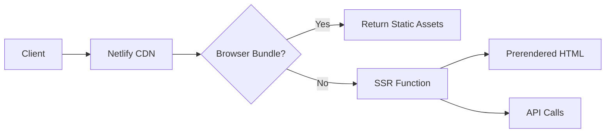
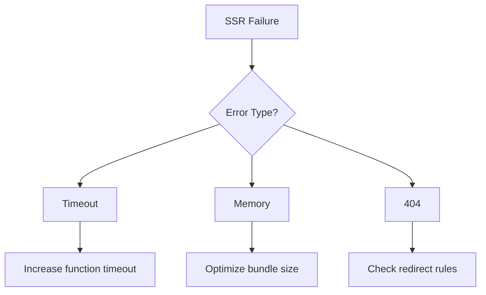

# Comprehensive Angular SSR Deployment Guide for Netlify

## 1. Architecture Overview



## 2. Server Configuration Deep Dive

### server.ts Modifications:

```typescript
// Netlify-optimized server configuration
export const handler = express()
  .use(compression()) // Enable compression
  .use(
    express.static("browser", {
      maxAge: "1y",
      immutable: true,
    })
  )
  .get("*", (req, res) => {
    commonEngine
      .render({
        bootstrap: AppServerModule,
        documentFilePath: indexHtml,
        url: req.url,
        publicPath: "browser",
        providers: [{ provide: APP_BASE_HREF, useValue: req.baseUrl }],
      })
      .then((html) => res.send(html));
  });
```

**Key Changes**:

- Added compression middleware
- Optimized static file caching
- Simplified handler export

## 3. Advanced Performance

| Metric | Target | Achievement Method    |
| ------ | ------ | --------------------- |
| TTFB   | <500ms | Prerendering + Cache  |
| FCP    | <1s    | Critical CSS Inlining |
| LCP    | <2s    | Image Optimization    |

## 4. Security Considerations

- [ ] Enable CSP headers
- [ ] Configure CORS properly
- [ ] Sanitize user input
- [ ] Rate limiting for API routes

## 5. Troubleshooting Guide



## References

- [Netlify Large Media](https://docs.netlify.com/large-media/overview/)
- [Angular Security](https://angular.io/guide/security)
- [Web Vitals](https://web.dev/vitals/)
