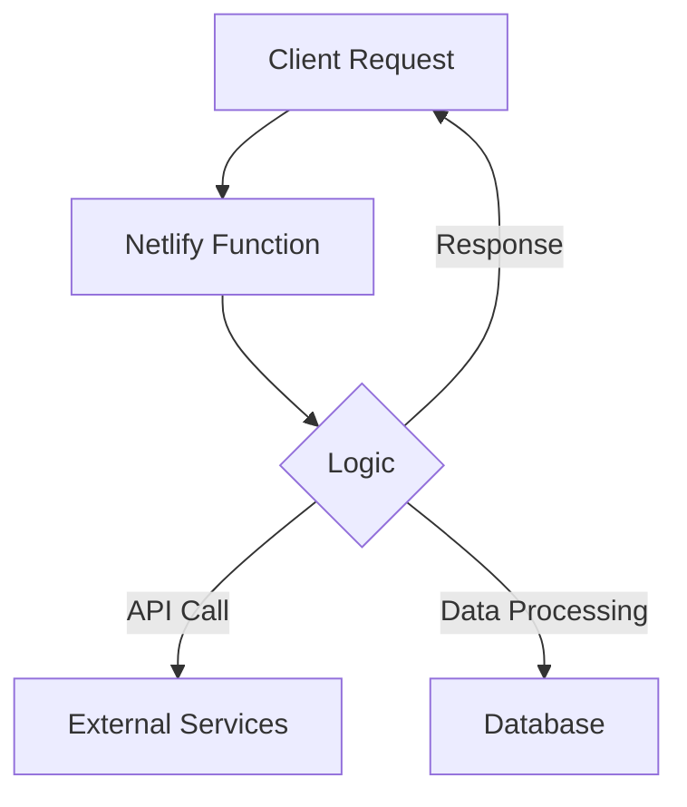

# Netlify Functions for SSR Projects

## Core Concepts


## Key SSR Use Cases

### 1. Form Processing Pattern
```typescript
// netlify/functions/process-form.ts
export const handler = async (event) => {
  if (event.httpMethod !== 'POST') {
    return { statusCode: 405, body: 'Method Not Allowed' };
  }

  const formData = JSON.parse(event.body);
  
  // Server-side validation
  if (!formData.email) {
    return { 
      statusCode: 400,
      body: JSON.stringify({ error: 'Email required' })
    };
  }

  // Process submission (e.g., save to DB)
  await saveToDatabase(formData);

  return {
    statusCode: 200,
    body: JSON.stringify({ success: true })
  };
};
```

### 2. Dynamic Meta Tags
```javascript
// netlify/functions/get-meta.js
exports.handler = async (event) => {
  const path = event.path;
  const metaData = await fetchMetaForRoute(path);
  
  return {
    headers: { 'Content-Type': 'application/json' },
    body: JSON.stringify({
      title: metaData.title,
      description: metaData.desc,
      image: metaData.imageUrl
    })
  };
};
```

### 3. API Aggregation
```typescript
// netlify/functions/aggregate-api.ts
interface ApiResponse {
  // Type definitions
}

export const handler = async (event) => {
  const [userData, contentData] = await Promise.all([
    fetchUserData(event.queryStringParameters.id),
    fetchContentData()
  ]);

  return {
    statusCode: 200,
    body: JSON.stringify({
      user: userData,
      content: contentData
    })
  };
};
```

## Configuration Best Practices

```toml
# netlify.toml
[build]
  functions = "netlify/functions" # Point to functions directory
  publish = "dist/your-app/browser" # SSR output directory

[[redirects]]
  from = "/api/*"
  to = "/.netlify/functions/:splat"
  status = 200
```

## Performance Patterns

1. **Cold Start Mitigation**
```typescript
// Warm-up function
export const handler = async () => {
  return { statusCode: 204 };
};
```

2. **Caching Strategy**
```javascript
// netlify/functions/cached-data.js
const cachedResponse = {
  headers: {
    'Cache-Control': 'public, max-age=3600',
    'CDN-Cache-Control': 'max-age=3600'
  },
  // ...rest of response
};
```

## Production-Ready API Examples

### 1. Content Moderation API
```typescript
// netlify/functions/content-moderation.ts
export const handler = async (event) => {
  const { text, images } = JSON.parse(event.body);
  
  const [textResult, imageResult] = await Promise.all([
    analyzeText(text),
    analyzeImages(images)
  ]);

  return {
    statusCode: 200,
    headers: { 'Content-Type': 'application/json' },
    body: JSON.stringify({
      isApproved: textResult.isClean && imageResult.isClean,
      flags: [...textResult.flags, ...imageResult.flags]
    })
  };
};
```

### 2. Geo-Location API
```typescript
// netlify/functions/geolocation.ts
export const handler = async (event) => {
  const ip = event.headers['x-nf-client-connection-ip'];
  const geoData = await fetch(`https://ipapi.co/${ip}/json/`);
  
  return {
    statusCode: 200,
    headers: { 
      'Cache-Control': 'public, max-age=3600',
      'Content-Type': 'application/json'
    },
    body: JSON.stringify(await geoData.json())
  };
};
```

### 3. Payment Processing API
```typescript
// netlify/functions/payment-processor.ts
import Stripe from 'stripe';

const stripe = new Stripe(process.env.STRIPE_SECRET_KEY!);

export const handler = async (event) => {
  const { amount, paymentMethod } = JSON.parse(event.body);
  
  const payment = await stripe.paymentIntents.create({
    amount: amount * 100, // Convert to cents
    currency: 'usd',
    payment_method: paymentMethod,
    confirmation_method: 'manual'
  });

  return {
    statusCode: 200,
    headers: { 'Content-Type': 'application/json' },
    body: JSON.stringify({
      clientSecret: payment.client_secret
    })
  };
};
```

## Debugging Tips

```bash
# Local testing
netlify dev

# Tail logs
netlify functions:logs --tail

## Token Generation:

netlify tokens:create --name "FormsAccess" --expires "30d" --json

## List All Forms:

curl -H "Authorization: Bearer YOUR_TOKEN" \
     "https://api.netlify.com/api/v1/sites/YOUR_SITE_ID/forms"

siteid: "b103db3a-b672-4475-9710-9a81e982c79d"