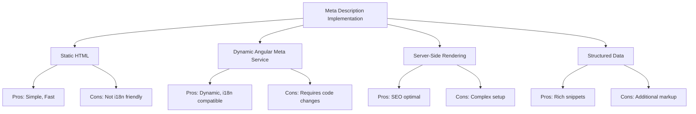

# Meta Description Implementation Guide

## Implementation Options



## 1. Static HTML in index.html

```html
<!-- Add to <head> section -->
<meta name="description" content="Your default page description" />
```

**Best for**: Simple sites with one language  
**Why choose**: Quickest implementation, no code changes needed

## 2. Angular Meta Service

```typescript
import { Meta } from '@angular/platform-browser';

constructor(private meta: Meta) {
  this.meta.updateTag({
    name: 'description',
    content: 'Dynamic description based on route'
  });
}
```

**Best for**: Dynamic content, multi-language sites  
**Why choose**: Full control from components, i18n integration

## 3. Server-Side Rendering (SSR)

Combine Angular Universal with Meta service for:

- Pre-rendered descriptions in initial HTML
- Dynamic updates on client-side

## 4. Structured Data (Schema.org)

```html
<script type="application/ld+json">
  {
    "@context": "https://schema.org",
    "@type": "WebPage",
    "description": "Your rich description for enhanced snippets"
  }
</script>
```

## Recommended Implementation

1. Add static fallback in index.html
2. Implement Angular Meta Service for dynamic pages
3. Ensure SSR properly renders meta tags
4. Add structured data for key pages

## Best Practices

- Keep under 160 characters
- Include primary keywords naturally
- Unique for each page
- Match page content accurately
