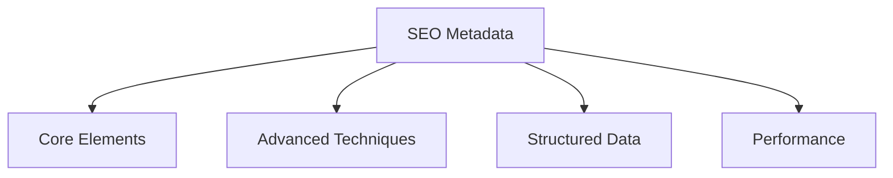

# Comprehensive Guide to SEO-Friendly Metadata in Landing Pages

## 1. Introduction to SEO Metadata
Search Engine Optimization (SEO) metadata helps search engines understand and properly index your landing pages. Effective metadata implementation can significantly improve click-through rates and search rankings.



## 2. Core Metadata Elements

### Title Tag
- **Purpose**: Primary title shown in search results
- **Best Practices**:
  - Keep under 60 characters
  - Include primary keyword near the front
  - Unique for each page
- **Example**: `<title>Best Running Shoes | Free Shipping | Acme Sports</title>`

### Meta Description
- **Purpose**: Short page summary in search results
- **Best Practices**:
  - 150-160 characters
  - Include call-to-action
  - Naturally include keywords
- **Example**: 
```html
<meta name="description" content="Shop top-rated running shoes with free shipping 
and 100-day returns. Find your perfect fit from our selection of 200+ styles.">
```

## 3. Advanced Metadata Techniques

### Open Graph (Social Media) Tags
```html
<meta property="og:title" content="Best Running Shoes | Acme Sports">
<meta property="og:description" content="Shop top-rated running shoes...">
<meta property="og:image" content="https://example.com/shoes.jpg">
<meta property="og:url" content="https://example.com/running-shoes">
```

### Twitter Card Tags
```html
<meta name="twitter:card" content="summary_large_image">
<meta name="twitter:site" content="@acmesports">
```

### Structured Data (Schema.org)
```html
<script type="application/ld+json">
{
  "@context": "https://schema.org",
  "@type": "Product",
  "name": "UltraRun Pro Shoes",
  "image": "https://example.com/shoes.jpg",
  "description": "High-performance running shoes...",
  "brand": {
    "@type": "Brand",
    "name": "Acme Sports"
  }
}
</script>
```

## 4. Angular-Specific Implementation

### Server-Side Rendering (SSR) Considerations
- Use `Meta` and `Title` services from `@angular/platform-browser`
- Implement dynamic metadata based on route
- Example service:
```typescript
import { Meta, Title } from '@angular/platform-browser';

constructor(private meta: Meta, private title: Title) {}

setProductMetadata(product: Product) {
  this.title.setTitle(`${product.name} | Acme Sports`);
  this.meta.updateTag({ name: 'description', content: product.shortDescription });
  
  // Open Graph tags
  this.meta.updateTag({ property: 'og:title', content: product.name });
  this.meta.updateTag({ property: 'og:image', content: product.imageUrl });
}
```

## 5. Testing and Validation
- Google Rich Results Test
- Facebook Sharing Debugger
- Twitter Card Validator
- Lighthouse SEO Audit

## 6. Performance Considerations
- Preload critical metadata
- Limit third-party scripts
- Implement lazy loading for non-critical elements

## 7. Common Pitfalls
- Duplicate title/meta tags
- Missing canonical tags
- Over-optimization (keyword stuffing)
- Ignoring mobile-specific requirements

## 8. Future Trends
- AI-generated metadata
- Voice search optimization
- Visual search metadata
- Increased importance of structured data

<!--
prevous 


create a s structures review report covering:
- Key metadata elements 
- open graph and twiter card tags
- stuctured data/schema.org markup canonical tags
- mobile optimizations considerations performance impacts


-->
