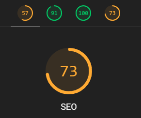
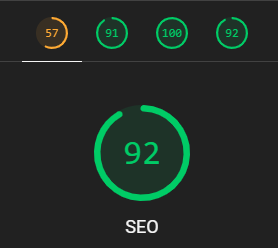

# Lighthouse Performance Reports

The ultimate guide to web performance:
https://youtu.be/0fONene3OIA?si=xwWkjvtFS4IAcbuw

## Before and After Scores

<!--
1. Open qa/lighthouse/reports/prod_report.html in browser
2. Capture screenshot of score gauges
3. Save as qa/lighthouse/scoreXX.png
-->





## Available Commands

The following Lighthouse commands are available as npm scripts:

### Generating Reports

```bash
# HTML Report (Production with auto-view)
lighthouse https://spa-seo-ssr.netlify.app/ --output html --output-path ./qa/lighthouse/reports/$("%Y-%m-%d").html --view

# JSON Data (Production)
lighthouse https://spa-seo-ssr.netlify.app/ --output json --output-path ./qa/lighthouse/reports/$(date +"%Y-%m-%d").json

# JSON Data (Local Development)
lighthouse http://localhost:4000 --output html --output-path ./qa/lighthouse/reports/local_$(date +"%Y-%m-%d").html --view
```

lighthouse http://localhost:4000 --output html --output-path ./qa/lighthouse/reports/$(date +"%Y-%m-%d").html --view

# Production Environment

npm run lh:prod # HTML report (auto-opens viewer)
npm run lh:prod:json # JSON data report

# Development Environment

npm run lh:dev # HTML report (auto-opens viewer)
npm run lh:dev:json # JSON data report

````

## Direct Lighthouse Usage
You can also run Lighthouse directly:

```bash
# Production
lighthouse https://spa-seo-ssr.netlify.app/ --output html --output-path ./qa/lighthouse/reports/prod_report.html --view
lighthouse https://spa-seo-ssr.netlify.app/ --output json --output-path ./qa/lighthouse/reports/prod_report.json

# Development
lighthouse http://localhost:4000 --output html --output-path ./qa/lighthouse/reports/dev_report.html --view
lighthouse http://localhost:4000 --output json --output-path ./qa/lighthouse/reports/dev_report.json
````

## Best Practices

1. Run audits in consistent conditions
2. Save both HTML and JSON formats
3. Document findings in the `docs/` folder and Update scores screenshot after major changes
4. Compare reports over time

<!--
NOTES, DONT DELETE..

"lh:prod": "lighthouse https://spa-seo-ssr.netlify.app/ --output html --output-path ./qa/lighthouse/reports/prod_$(date +\"%Y-%m-%d\")PROD.html --view",
    "lh:prod:json": "lighthouse https://spa-seo-ssr.netlify.app/ --output json --output-path ./qa/lighthouse/reports/prod_$(date +\"%Y-%m-%d\")PROD.json",
    "lh:dev": "lighthouse http://localhost:4000 --output html --output-path ./qa/lighthouse/reports/dev_$(date +\"%Y-%m-%d\")DEV.html --view",
    "lh:dev:json": "lighthouse http://localhost:4000 --output json --output-path ./qa/lighthouse/reports/dev_$(date +\"%Y-%m-%d\")DEV.json",

    LEGACY VIDEO OF LIGHTHOUSE
    https://youtu.be/TBr1NGSu_p0?si=TAs5vQkB-NXbGy2Q
-->
