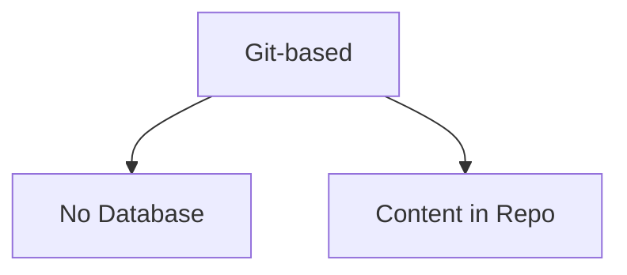
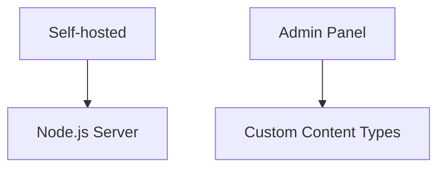
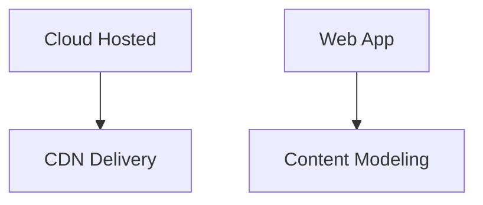
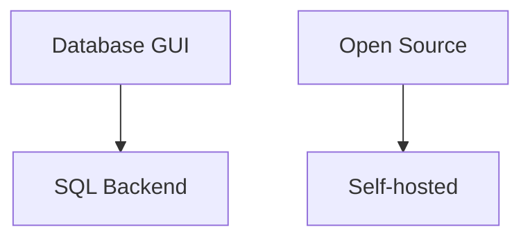
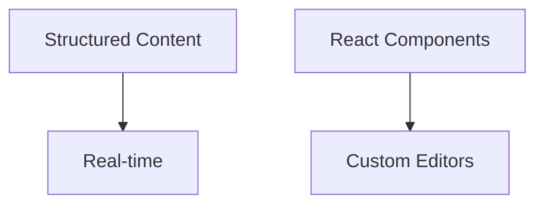

# Headless CMS Comparison for Angular/Netlify Project

## Evaluated Options

1. Netlify CMS
2. Strapi
3. Contentful
4. Directus
5. Sanity.io

## Evaluation Criteria

1. **Setup Complexity**
2. **Maintenance Needs**
3. **Integration Effort**
4. **Free Tier Limitations**
5. **Content Modeling Flexibility**

## Detailed Comparison

### 1. Netlify CMS

**Pros**:

- Native Netlify integration
- Content versioned with code
- No additional hosting

**Cons**:

- Basic content modeling
- Limited editor features

### 2. Strapi

**Pros**:

- Full customization
- Plugin ecosystem
- Local development friendly

**Cons**:

- Requires maintenance
- Separate hosting needed

### 3. Contentful

**Pros**:

- Professional UI
- Scalable infrastructure
- Strong API

**Cons**:

- Vendor lock-in
- Complex for simple needs

### 4. Directus

**Pros**:

- Pure database interface
- Works with existing SQL
- No content lock-in

**Cons**:

- Requires database knowledge
- More technical setup

### 5. Sanity.io

**Pros**:

- Developer-friendly
- Portable text format
- Real-time updates

**Cons**:

- Learning curve
- Query language required

## Recommendation Matrix

| CMS         | Best For                          | Not Ideal For          |
| ----------- | --------------------------------- | ---------------------- |
| Netlify CMS | Simple, git-based content         | Complex content models |
| Strapi      | Custom self-hosted solutions      | Quick setup needs      |
| Contentful  | Enterprise-scale projects         | Budget constraints     |
| Directus    | Database-driven applications      | Non-technical teams    |
| Sanity      | Developer-centric implementations | Simple brochure sites  |
