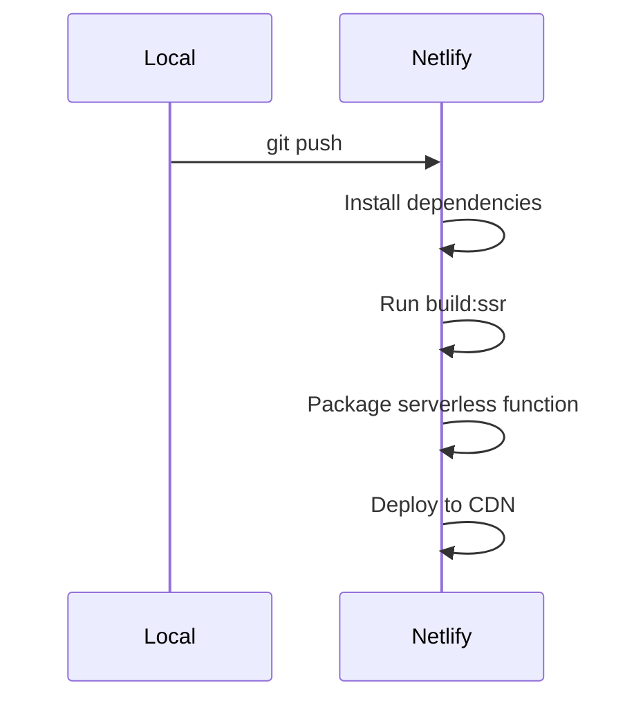

# Updated Angular SSR Netlify Deployment Plan

## 1. Current Implementation Gaps

### Configuration Issues:

- [ ] server.ts not properly configured for Netlify Functions
- [ ] netlify.toml missing functions directory
- [ ] Missing performance optimizations
- [ ] Incomplete security configuration

## 2. Required Changes

### server.ts Updates:

```typescript
// Replace run() with Netlify-optimized handler
export const handler = express()
  .use(compression())
  .use(
    express.static("browser", {
      maxAge: "1y",
      immutable: true,
    })
  )
  .get("*", (req, res) => {
    commonEngine
      .render({
        bootstrap: AppServerModule,
        documentFilePath: indexHtml,
        url: req.url,
        publicPath: "browser",
        providers: [{ provide: APP_BASE_HREF, useValue: req.baseUrl }],
      })
      .then((html) => res.send(html));
  });
```

### netlify.toml Updates:

```toml
[build]
  command = "npm run build:ssr"
  publish = "dist/ng17-ssr/browser"
  functions = "dist/ng17-ssr/server"  # Add this line

[[redirects]]
  from = "/*"
  to = "/index.html"
  status = 200
```

## 3. Deployment Process



## 4. Performance Checklist

- [ ] Enable prerendering for critical routes
- [ ] Configure proper caching headers
- [ ] Optimize images via Netlify Large Media
- [ ] Set up proper function timeouts (max 10s)

## 5. Security Checklist

- [ ] Configure CSP headers
- [ ] Set up proper CORS
- [ ] Implement rate limiting
- [ ] Sanitize all user input

## 6. Verification Steps

1. Test SSR by checking page source
2. Verify function logs in Netlify dashboard
3. Run Cypress tests against production
4. Check Web Vitals metrics

## 7. Alternative: CLI Deployment Without Functions

For simpler deployments or when SSR isn't required, you can use:

```bash
netlify deploy --prod --function=false
```

**When to use this approach:**

- Static site generation only
- No server-side rendering needed
- Quick testing deployments

**Requirements:**

1. Properly configured `_redirects` file
2. All routes must resolve to static assets
3. No dynamic server-side logic

**Limitations:**

- No SSR capabilities
- Limited to static site features
- No serverless functions

## 8. Troubleshooting Guide

## 8. References and Sources

### Official Documentation:

- [Netlify Angular SSR Guide](https://docs.netlify.com/integrations/frameworks/angular/)
- [Angular Universal Documentation](https://angular.io/guide/universal)
- [Netlify Functions Configuration](https://docs.netlify.com/functions/overview/)

### Performance Optimization:

- [Web Vitals Optimization](https://web.dev/vitals/)
- [Netlify Large Media](https://docs.netlify.com/large-media/overview/)
- [Angular Performance Checklist](https://angular.io/guide/performance)

### Security Best Practices:

- [Angular Security Guide](https://angular.io/guide/security)
- [OWASP Security Cheatsheets](https://cheatsheetseries.owasp.org/)
- [Netlify Security Headers](https://docs.netlify.com/routing/headers/)

### Community Resources:

- [Angular Universal with Netlify (Community Guide)](https://github.com/angular/universal-starter)
- [Serverless Angular Case Studies](https://www.netlify.com/blog/tags/angular/)

| Symptom        | Solution                    |
| -------------- | --------------------------- |
| SSR timeout    | Increase function timeout   |
| Missing assets | Check publish directory     |
| 404 errors     | Verify redirect rules       |
| i18n issues    | Check deployed translations |
